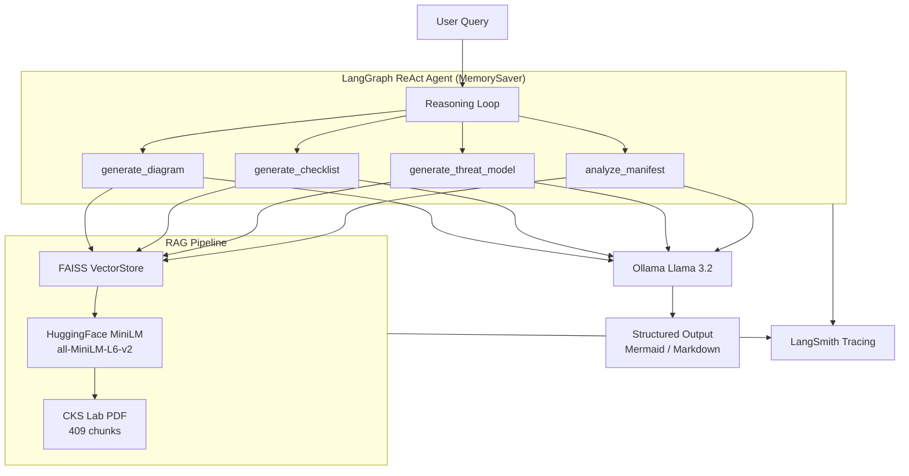

# CKS Architect Design Agent

A RAG-powered agent that generates Kubernetes security artifacts — architecture diagrams, hardening checklists, and threat models — grounded in CKS lab documentation.

Mar 27, 2026.

---

## Architecture



---

## Stack

| Layer | Tool |
|---|---|
| LLM | Ollama + Llama 3.2 (`temperature=0`) |
| Embeddings | HuggingFace `all-MiniLM-L6-v2` |
| Vector store | FAISS (persisted to `faiss_index/`) |
| Orchestration | LangGraph ReAct (`create_react_agent`) |
| Chains | LangChain LCEL |
| PDF extraction | PyMuPDF |
| Observability | LangSmith |

---

## Project Structure

```
cks-rag-agent/
├── src/
│   ├── __main__.py      # CLI entrypoint (python -m src)
│   ├── agent.py         # LangGraph ReAct agent, run_agent()
│   ├── tools.py         # 4 @tool functions
│   ├── chain.py         # LCEL RAG chain
│   ├── vectorstore.py   # FAISS build / load / get_retriever()
│   ├── embeddings.py    # HuggingFaceEmbeddings
│   └── ingest.py        # load_documents() + chunk_documents()
├── data/
│   ├── raw/             # Drop PDFs here to index (gitignored — add your own)
│   └── manifests/
│       ├── insecure-pod.yaml        # Demo manifest: every bad practice enabled
│       └── secure-deployment.yaml  # Hardened deployment for contrast
├── faiss_index/         # Persisted FAISS index (gitignored — rebuilt on ingest)
├── output/              # Generated artifacts saved with --save flag
│   ├── *.mmd            # Mermaid diagrams and threat models
│   └── *.md             # Hardening checklists
├── tests/
│   ├── test_agent.py    # Integration tests for all 4 tools + agent
│   ├── test_rag_pipeline.py
│   ├── test_tool_chain.py
│   ├── check_setup.py   # Environment health check
│   └── conftest.py      # pytest path setup
└── conftest.py          # Root pytest path setup
```

> **Note:** `data/raw/` and `faiss_index/` are gitignored. After cloning, add your CKS PDF to `data/raw/` and run the ingest step before using the agent.

---

## Quick Start

### Prerequisites

```sh
brew install ollama
ollama serve
ollama pull llama3.2
```

### Install

```sh
python3 -m venv .venv
source .venv/bin/activate
pip install -r requirements.txt
```

### Configure

Create a `.env` file:

```sh
LANGCHAIN_TRACING_V2=true
LANGCHAIN_API_KEY=<your-langsmith-key>
LANGCHAIN_PROJECT=cks-rag-agent
```

### Ingest a PDF

Drop a CKS PDF into `data/raw/`, then:

```sh
python -c "
from src.ingest import load_documents, chunk_documents
from src.vectorstore import build_vectorstore
docs = load_documents('data/raw')
chunks = chunk_documents(docs)
build_vectorstore(chunks)
print(f'Indexed {len(chunks)} chunks')
"
```

The vectorstore is saved to `faiss_index/` and reused on every run.

---

## Usage

### CLI (recommended)

```sh
# Print output to terminal
python -m src "Generate a diagram for Kubernetes RBAC"
python -m src "Generate a hardening checklist for Pod Security Admission"
python -m src "Generate a threat model for etcd access"

# Save output to output/ directory
python -m src "Generate a diagram for Kubernetes RBAC" --save
# → output/generate_a_diagram_for_kubernetes_rbac.mmd

python -m src "Generate a hardening checklist for Pod Security Admission" --save
# → output/generate_a_hardening_checklist_for_pod_security_admission.md

python -m src "Generate a threat model for etcd access" --save
# → output/generate_a_threat_model_for_etcd_access.mmd

# Analyze a Kubernetes YAML manifest for security issues
python -m src --manifest data/manifests/insecure-pod.yaml
python -m src --manifest data/manifests/insecure-pod.yaml --save
# → output/manifest_insecure-pod_yaml.mmd
```

Mermaid output (`.mmd`) can be previewed in:
- [mermaid.live](https://mermaid.live) — paste and render instantly
- VSCode with the **Mermaid Preview** extension

### Interactive REPL (multi-turn session)

Running with no arguments starts an interactive session. The agent retains memory across turns within the session (same `thread_id`), so follow-up queries can reference previous outputs.

```sh
python -m src
# CKS Agent  |  session: a1b2c3d4  |  type 'exit' to quit

> Generate a diagram for RBAC
# → Mermaid graph TD for RBAC

> Now generate a threat model for the same topic
# → Agent uses session memory to resolve "the same topic" → RBAC
# → Mermaid sequenceDiagram showing RBAC threat vectors

> Export the threat model as a checklist
# → Agent uses session context to understand "the threat model" → generates RBAC checklist
```

Other REPL examples:

```sh
> --manifest data/manifests/insecure-pod.yaml --save
# → Analyzes manifest, saves to output/manifest_insecure_pod_yaml.mmd

> Generate a checklist for Pod Security Admission --save
# → Saves to output/generate_a_checklist_for_pod_security_admission.md
```

Inside the REPL:
- Type any query and press Enter
- Follow-up with `now`, `same topic`, `change it to` — the agent has context of the full session
- Use `--manifest <path>` to analyze a YAML file
- Append `--save` to any query to write the output to `output/`
- Type `exit` or `quit` to end the session

### Run the agent directly

```sh
python -c "
from src.agent import stream_agent
print(stream_agent('Generate a Mermaid architecture diagram for Kubernetes RBAC'))
"
```

### Call a tool directly

```sh
python -c "
from src.tools import generate_checklist
print(generate_checklist.invoke('Pod Security Admission'))
"
```

### Run the RAG chain

```sh
python -c "
from src.chain import get_rag_chain
chain = get_rag_chain()
print(chain.invoke('What are the CKS requirements for network policies?'))
"
```

---

## Tools

Each tool retrieves 4 chunks from the FAISS vectorstore, then passes the context to Llama 3.2 with a structured output prompt.

| Tool | Input | Output |
|---|---|---|
| `generate_diagram` | topic string | Mermaid `graph TD` architecture diagram with subgraphs (Auth, Network, Runtime layers) |
| `generate_checklist` | topic string | Markdown table: Control / Description / Priority / Source (with PDF page citations) |
| `generate_threat_model` | topic string | Mermaid `sequenceDiagram` threat model — always ends with attack blocked/mitigated |
| `analyze_manifest` | raw YAML string | Mermaid `graph TD` security posture diagram showing risks, controls, and mitigations |

### Source citations in checklists

`generate_checklist` uses `_get_context_with_sources`, which tags each retrieved chunk with its PDF page number. The output table includes a **Source** column citing which pages informed each row, plus a footer line with the full page range:

```
| Control | Description | Priority | Source |
|---|---|---|---|
| Disable hostPID | Never set hostPID: true in production pods | Critical | p.47 |
| Drop ALL capabilities | Drop ALL capabilities then re-add only what's needed | High | p.52, p.53 |
...
**Source:** LFS260 Kubernetes Security Labs — pp. 47, 52, 53
```

This grounds every checklist item in the actual CKS lab documentation.

### Mermaid validation + auto-retry

All three Mermaid-generating tools (`generate_diagram`, `generate_threat_model`, `analyze_manifest`) pass their output through `_validate_mermaid` before returning. If the LLM produces invalid syntax (wrong keyword, no edges, nested brackets, markdown fences), the output is automatically corrected or the chain is retried once with a stricter prompt. `_clean_mermaid` strips ` ```mermaid ` fences unconditionally on every response.

### Manifest analysis

`analyze_manifest` statically parses the YAML before calling the LLM via `_extract_security_summary`. It detects:

**Risks detected:**
- `hostPID: true` — shares host process namespace
- `hostNetwork: true` — bypasses network isolation
- `hostIPC: true` — shares host IPC namespace
- `serviceAccountName: default` — overprivileged default SA
- `runAsNonRoot` not set — container may run as root
- `seccompProfile` not set — no syscall filtering
- `privileged: true` — full host access per container
- `allowPrivilegeEscalation` not disabled — per container
- `readOnlyRootFilesystem` not set — per container
- capabilities added (e.g. `SYS_ADMIN`) — per container
- no capabilities dropped — per container
- image tag `:latest` — unpinned image, per container
- `hostPath` volume mounts — host filesystem access

**Controls recognized:**
- Non-default `serviceAccountName`
- `runAsNonRoot: true`
- `seccompProfile` type (e.g. `RuntimeDefault`)
- `allowPrivilegeEscalation: false` per container
- `readOnlyRootFilesystem: true` per container
- `capabilities drop: ALL` per container

Also supports **NetworkPolicy** manifests — flags missing ingress or egress rules.

The structured risk/control summary is used to build a targeted RAG query, so the diagram's mitigations are grounded in CKS documentation rather than generic advice.

---

## Output Files

When `--save` is passed, artifacts are written to `output/` with filenames derived from the query:

| Query type | Extension | Preview |
|---|---|---|
| `generate_diagram` | `.mmd` | [mermaid.live](https://mermaid.live) or VSCode Mermaid Preview |
| `generate_threat_model` | `.mmd` | [mermaid.live](https://mermaid.live) or VSCode Mermaid Preview |
| `analyze_manifest` | `.mmd` | [mermaid.live](https://mermaid.live) or VSCode Mermaid Preview |
| `generate_checklist` | `.md` | Any Markdown viewer |

---

## Session Memory

The agent uses LangGraph's `MemorySaver` checkpointer. Each CLI invocation (or REPL session) gets a unique `thread_id`, so the agent can handle follow-up requests like:

```
> Generate a diagram for Kubernetes RBAC
> Now add OPA Gatekeeper to it
> Change the format to a threat model
```

Memory is scoped to the session — it does not persist across separate `python -m src` invocations.

---

## Observability

All runs are traced in LangSmith under the `cks-rag-agent` project. Each trace shows:

- ReAct reasoning loop steps
- Tool selection and inputs
- VectorStore retrieval (which chunks were pulled)
- LLM calls with token counts and latency

View at: **smith.langchain.com → Tracing → cks-rag-agent**

---

## Tests

```sh
pytest tests/
```

| File | Classes / what it tests |
|---|---|
| `tests/test_agent.py` | `TestGenerateDiagram`, `TestGenerateChecklist` (incl. source citations), `TestGenerateThreatModel`, `TestRunAgent`, `TestStreamAgent`, `TestSessionMemory`, `TestMermaidValidator` (unit — no Ollama), `TestExtractSecuritySummary` (unit — no Ollama), `TestAnalyzeManifest` |
| `tests/test_rag_pipeline.py` | Vectorstore build, retrieval, chunk count, grounded answers |
| `tests/test_tool_chain.py` | LCEL chain wiring for each tool |
| `tests/check_setup.py` | Environment health check (Ollama reachable, FAISS index exists) |

The `TestMermaidValidator` and `TestExtractSecuritySummary` classes are pure unit tests with no Ollama dependency — fast to run in isolation:

```sh
pytest tests/test_agent.py::TestMermaidValidator tests/test_agent.py::TestExtractSecuritySummary -v
```
